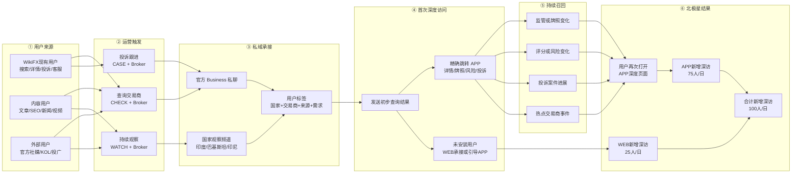
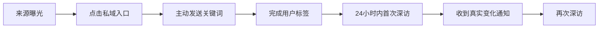

# 自然北极星私域运营闭环图

## 一、目标与方案定位

- **业务目标：** 每日新增 100 个深度访问用户。
- **目标拆分：** APP 新增深访 75 人/日，WEB 新增深访 25 人/日。
- **执行原则：** 不修改产品，通过现有用户触点、内容、KOL、官方社媒和私域运营完成闭环。
- **核心逻辑：** 用户因为“想查询或持续关注某个交易商”进入私域；运营人员利用真实的牌照、风险、投诉和案件变化，把用户再次召回到对应的 APP 深度页面。

> 私域不是单纯建群。只有用户主动发送 `CHECK / WATCH / CASE + 交易商名称`，并完成国家、交易商、来源和需求标签，才算有效私域用户。

## 二、整体运营闭环

## 三、与流程匹配的运营动作

| 环节 | 主要用户 | Carmy 的运营动作 | 给用户的理由 | 关键数据 |
|---|---|---|---|---|
| 用户识别 | 搜索交易商、查看详情、投诉、咨询客服、阅读交易商内容的现有用户 | 从现有触点筛选有明确交易商意图的用户 | 继续查询或持续关注这家交易商 | 有效触达人数 |
| 入口触发 | 文章读者、社媒评论用户、KOL粉丝、投诉用户 | 在内容、回复和KOL口播中放置 CHECK、WATCH、CASE 入口 | 免费查询、风险观察、投诉进展跟踪 | 私域入口点击率 |
| 私域承接 | 主动发送关键词的用户 | 使用官方 WhatsApp Business 承接；按国家、交易商、来源、需求打标签 | 获得与自己关注对象相关的信息 | 有效 WATCH 用户数 |
| 首次深访 | 已完成标签的用户 | 返回简要结果，并提供对应交易商的 APP 深度页链接；无APP时由WEB承接 | 查看完整牌照、评分、风险和投诉 | 入池后24小时深访率 |
| 持续运营 | 已关注具体交易商的用户 | 监测真实的监管、牌照、风险、评分、投诉和案件变化 | 只在关注对象出现新变化时提醒 | 有效提醒数量、消息打开率 |
| 二次召回 | 收到变化提醒的用户 | 通知内容直接指向发生变化的交易商深度页面 | 查看具体变化和证据 | 重复深访人数、7日回访率 |
| 效果归因 | 全部渠道用户 | 每个国家、渠道、KOL和内容使用独立链接或来源码 | — | 来源→WATCH→首次深访→重复深访 |

## 四、三个运营入口

| 入口 | 用户需求 | 回复内容 | 后续动作 |
|---|---|---|---|
| `CHECK + Broker` | 我想查这家交易商是否安全 | 简要结论 + 完整 APP 详情链接 | 邀请用户转为 WATCH |
| `WATCH + Broker` | 我想持续关注这家交易商 | 当前状态 + 已加入观察说明 + APP详情链接 | 有真实变化时再次召回 |
| `CASE + Broker` | 我想查询投诉或案件进度 | 当前案件状态 + 投诉/案件详情链接 | 进展变化时定向通知 |

## 五、不同来源怎么导入私域

| 来源 | 私域入口设计 | 归因方法 |
|---|---|---|
| 交易商文章、SEO、新闻 | 文中或文末：“发送 WATCH + 交易商名称，持续获取风险变化” | 内容编号或文章来源码 |
| 视频、官方社媒 | 评论区置顶或简介中的国家专属入口 | 平台来源码 |
| KOL | 每个KOL独立链接、二维码或关键词 | KOL编号 |
| 投诉、客服用户 | 在案件回复或咨询结束时邀请持续跟进 | CASE来源码 |
| WikiFX现有用户 | 在现有可运营消息、内容回复或客服触点中邀请关注 | existing来源码 |
| 付费广告 | 只用于补量或测试，不与自然流量混算 | paid来源码 |

## 六、数据归因链路

每个有效用户至少记录以下字段：

`用户ID/联系方式 + 国家 + 语言 + 来源渠道 + 来源编号 + 交易商 + CHECK/WATCH/CASE + 入池时间 + 首次深访时间 + 重复深访时间`

核心判断：

- **入口有效：** 私域入口点击率、关键词发送率提升。
- **承接有效：** 完成标签后24小时内的APP深访率提升。
- **内容有效：** 某篇内容或某个KOL带来的有效WATCH和深访人数更多。
- **召回有效：** 收到真实变化提醒后产生重复深访。
- **没有做好：** 在哪一步出现明显流失，就优化该环节，而不是只看群人数或总点击量。

## 七、小范围验证方式

- 先选择 **1个国家、3—5家高关注交易商、1个官方账号、1—2个KOL或内容入口**。
- 建立国家观察频道和官方 Business 私聊承接。
- 连续测试7—14天，分别记录内容、KOL、现有用户和社媒来源。
- 第一阶段先验证“用户是否愿意主动WATCH”和“WATCH后是否进入APP深访”。
- 第二阶段再验证“真实变化提醒是否能带来重复深访”。
- 验证成立后，再复制到印度、巴基斯坦和印尼三个市场。

## 八、汇报结论

这套方案不是单纯建群，而是围绕具体交易商建立用户观察关系：先利用现有内容、用户和KOL找到有明确需求的人，再通过官方私域完成标签和承接；首次返回结果带动APP深访，后续利用真实变化持续召回，最终形成可归因、可验证、可复制的每日新增深访闭环。
